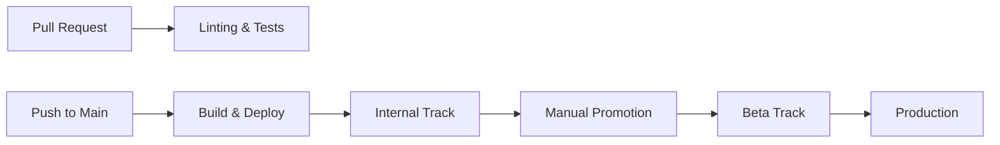

# GitHub Actions Setup Guide

## Overview

This guide covers the complete setup of GitHub Actions workflows for continuous integration and deployment of the Flutter app to Google Play Store.

## Architecture



## Required GitHub Secrets

Configure the following secrets in your repository settings (`Settings > Secrets and variables > Actions`):

### 1. Android Signing Keys

#### `ANDROID_KEYSTORE_BASE64`
- **Description**: Base64-encoded Android keystore file
- **How to generate**:
  ```bash
  # Create a new keystore (if you don't have one)
  keytool -genkey -v -keystore upload-keystore.jks -keyalg RSA \
          -keysize 2048 -validity 10000 -alias upload

  # Encode to base64
  base64 -i upload-keystore.jks | pbcopy  # macOS
  base64 upload-keystore.jks | xclip -selection clipboard  # Linux
  ```

#### `ANDROID_KEYSTORE_PASSWORD`
- **Description**: Password for the keystore file
- **Example**: `your-keystore-password`

#### `ANDROID_KEY_PASSWORD`
- **Description**: Password for the key alias
- **Example**: `your-key-password`

#### `ANDROID_KEY_ALIAS`
- **Description**: Alias name for the signing key
- **Example**: `upload`

### 2. Google Play Store Credentials

#### `PLAY_STORE_CONFIG_JSON`
- **Description**: Base64-encoded Google Play service account JSON
- **How to obtain**:
  1. Go to [Google Play Console](https://play.google.com/console)
  2. Navigate to `Setup > API access`
  3. Create a service account or link existing
  4. Download the JSON key file
  5. Encode to base64:
     ```bash
     base64 -i play-store-key.json | pbcopy  # macOS
     base64 play-store-key.json | xclip -selection clipboard  # Linux
     ```

### 3. Optional Integrations

#### `CODECOV_TOKEN`
- **Description**: Token for Codecov integration
- **How to obtain**: Sign up at [codecov.io](https://codecov.io) and get token from repository settings

#### `SLACK_WEBHOOK`
- **Description**: Slack webhook URL for notifications
- **How to obtain**: Create incoming webhook in Slack workspace settings

## Android Project Configuration

### 1. Update `android/app/build.gradle`

```gradle
android {
    // ... other configurations

    signingConfigs {
        release {
            keyAlias keystoreProperties['keyAlias']
            keyPassword keystoreProperties['keyPassword']
            storeFile keystoreProperties['storeFile'] ? file(keystoreProperties['storeFile']) : null
            storePassword keystoreProperties['storePassword']
        }
    }

    buildTypes {
        release {
            signingConfig signingConfigs.release
            minifyEnabled true
            proguardFiles getDefaultProguardFile('proguard-android.txt'), 'proguard-rules.pro'
        }
    }
}

// Load keystore properties
def keystorePropertiesFile = rootProject.file("key.properties")
def keystoreProperties = new Properties()
if (keystorePropertiesFile.exists()) {
    keystoreProperties.load(new FileInputStream(keystorePropertiesFile))
}
```

### 2. Update Package Name

Edit `android/fastlane/Appfile`:
```ruby
package_name("com.yourcompany.yourapp") # Replace with your actual package name
```

## Workflow Files

The setup includes the following workflows:

### 1. PR Checks (`pr-checks.yml`)
- Runs on every pull request
- Performs linting, formatting checks, and tests
- Generates coverage reports
- Builds debug APK for testing

### 2. Build & Deploy (`build-deploy.yml`)
- Triggered on push to main/master
- Automatically bumps version based on commit messages
- Builds release AAB and APK
- Deploys to Play Store internal track
- Creates GitHub release with artifacts

### 3. Promote Release (`promote-release.yml`)
- Manual workflow for promoting between tracks
- Validates promotion paths
- Supports staged rollout for production
- Creates rollout control issues

### 4. Hotfix (`hotfix.yml`)
- Emergency fix workflow
- Bypasses normal release process
- Direct deployment to production

## Version Management

### Semantic Versioning

The system uses semantic versioning with automatic bumping:

- **BREAKING CHANGE** or `feat!`/`fix!` → Major version
- `feat:` → Minor version
- `fix:` → Patch version
- Build number always increments

### Manual Version Bump

```bash
# Bump major version (1.0.0 -> 2.0.0)
./scripts/bump-version.sh major

# Bump minor version (1.0.0 -> 1.1.0)
./scripts/bump-version.sh minor

# Bump patch version (1.0.0 -> 1.0.1)
./scripts/bump-version.sh patch

# Bump only build number
./scripts/bump-version.sh build
```

## Deployment Strategy

### Track Progression

1. **Internal Track** (Automatic)
   - Deployed on every merge to main
   - For internal testing team

2. **Alpha/Beta Track** (Manual)
   - Promoted from internal track
   - For external testers

3. **Production Track** (Manual)
   - Promoted from beta track
   - Staged rollout (10% → 25% → 50% → 100%)

### Promotion Process

```bash
# Using GitHub UI
1. Go to Actions > Promote Release
2. Click "Run workflow"
3. Select version tag, source and target tracks
4. For production, specify rollout percentage

# Monitor rollout
- Check created GitHub issue for rollout checklist
- Use "Update Rollout" workflow to increase percentage
- Use "Halt Rollout" if issues detected
```

## Release Notes

Release notes are automatically generated from commit messages:

```bash
# Generate manually
./scripts/generate-release-notes.sh v1.0.0 v1.1.0

# Format in commits
feat: Add user authentication
fix: Resolve crash on startup
perf: Optimize image loading
```

## Build Artifacts

### Artifact Retention

- **Release builds**: 90 days
- **Debug builds**: 7 days
- **Coverage reports**: 30 days

### Artifact Structure

```
release-aab-v1.0.0/
  └── app-release.aab

release-apks-v1.0.0/
  ├── app-arm64-v8a-release.apk
  ├── app-armeabi-v7a-release.apk
  └── app-x86_64-release.apk

checksums-v1.0.0/
  └── checksums.sha256
```

## Monitoring & Alerts

### Build Status Badges

Add to `README.md`:

```markdown


```

### Slack Notifications

Notifications are sent for:
- Build failures
- Successful deployments
- Promotion completions
- Rollout status changes

## Troubleshooting

### Common Issues

1. **Build fails with signing error**
   - Verify all keystore secrets are correctly set
   - Check base64 encoding doesn't include newlines

2. **Play Store upload fails**
   - Ensure service account has proper permissions
   - Verify package name matches Play Console

3. **Version conflicts**
   - Version code must always increment
   - Cannot upload same version code twice

4. **Fastlane errors**
   - Run `bundle install` in android directory
   - Update Ruby version if needed

### Debug Commands

```bash
# Test Fastlane locally
cd android
bundle exec fastlane track_status track:internal

# Verify keystore
keytool -list -v -keystore upload-keystore.jks

# Check workflow syntax
act -l  # Using act tool for local testing
```

## Security Best Practices

1. **Rotate keys regularly**
   - Update signing keys yearly
   - Rotate service account keys quarterly

2. **Limit permissions**
   - Service account: Only Play Console access
   - GitHub tokens: Minimal required scopes

3. **Audit access**
   - Review secret access logs
   - Monitor deployment history

4. **Environment separation**
   - Use different keys for dev/staging/prod
   - Separate Play Console tracks

## Maintenance

### Regular Tasks

- **Weekly**: Review pending promotions
- **Monthly**: Check artifact storage usage
- **Quarterly**: Update dependencies and actions
- **Yearly**: Rotate signing keys

### Updating Workflows

1. Test changes in feature branch
2. Use workflow dispatch for validation
3. Monitor first production deployment

## Support

For issues or questions:
1. Check workflow run logs
2. Review this documentation
3. Contact DevOps team
4. File issue in repository